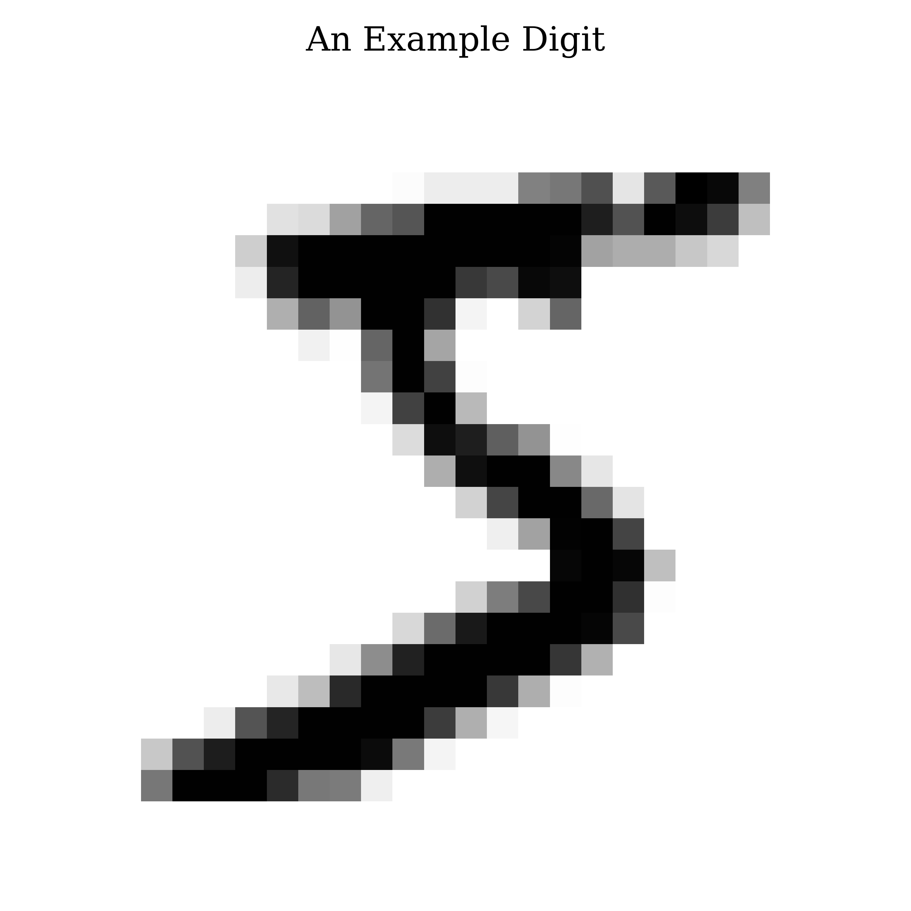
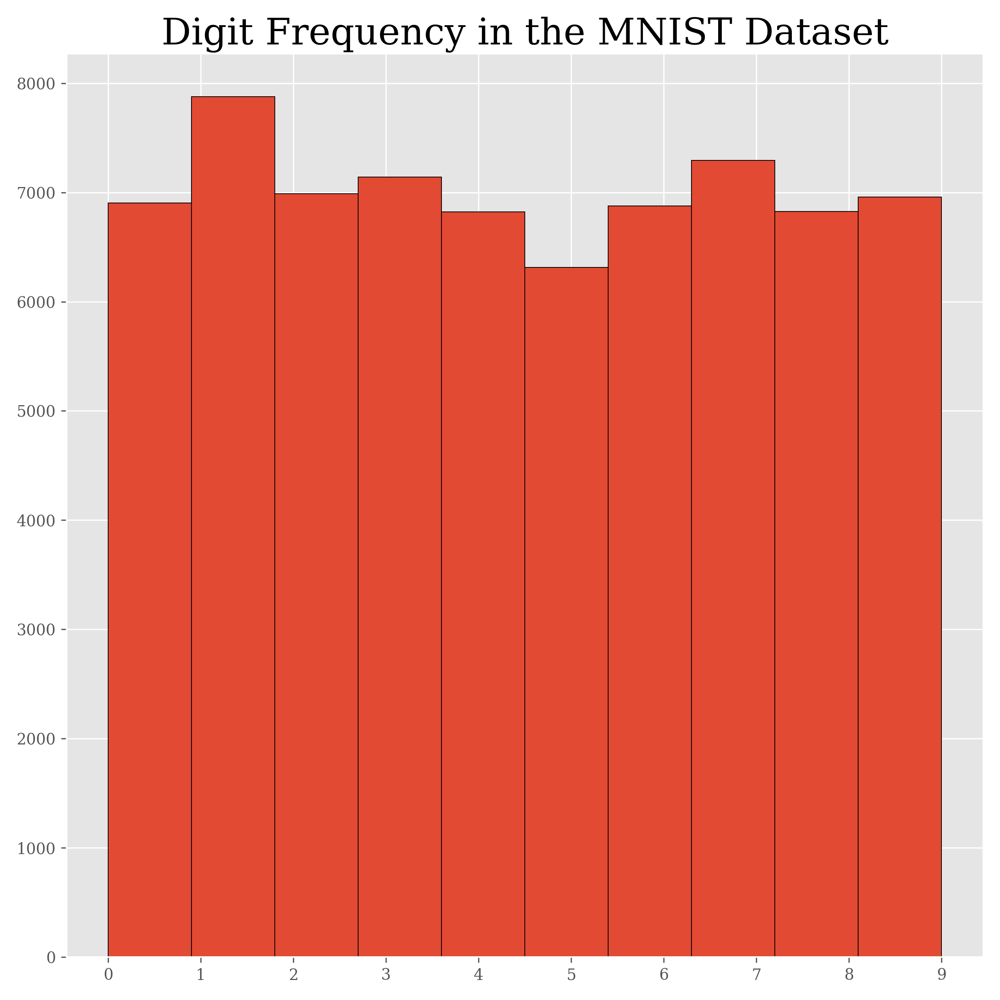
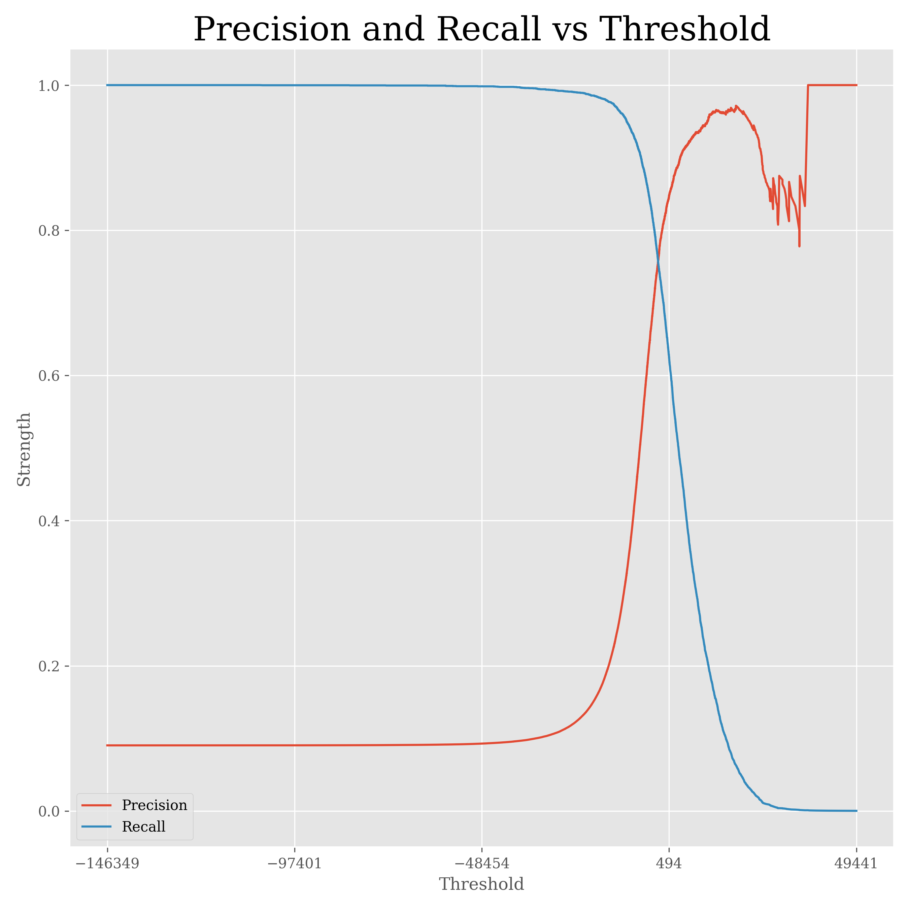
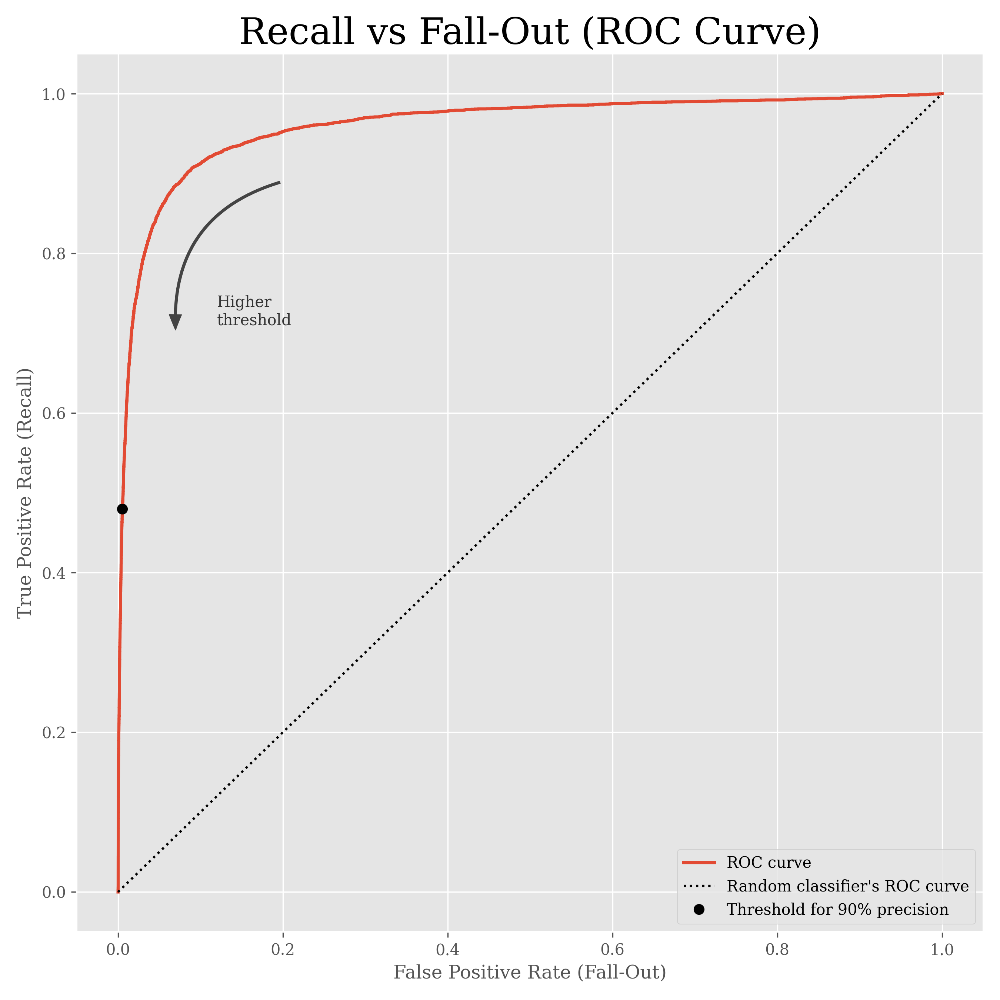
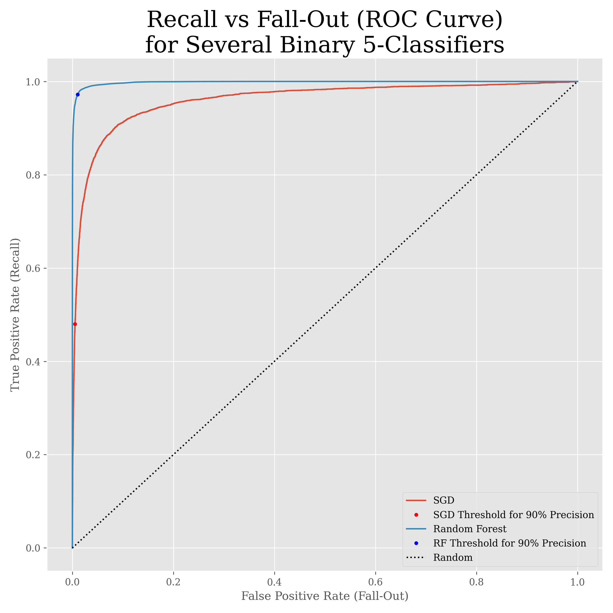
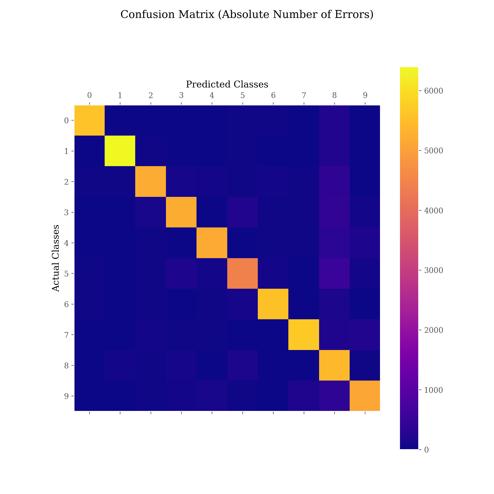
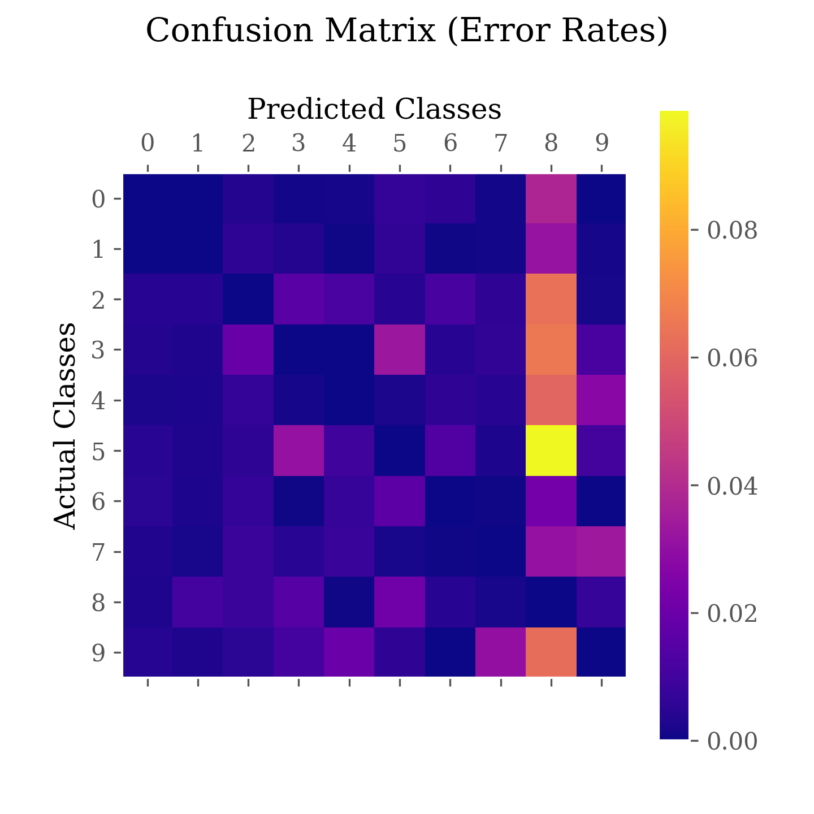
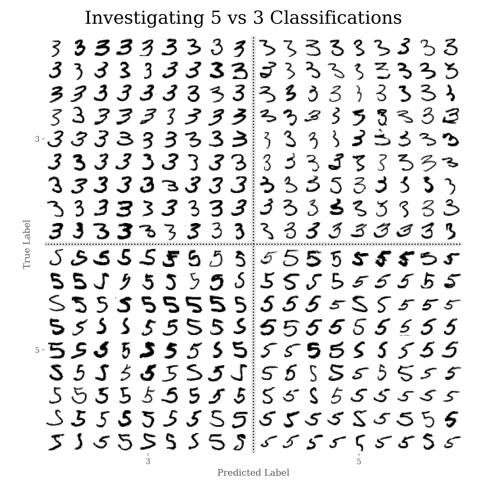
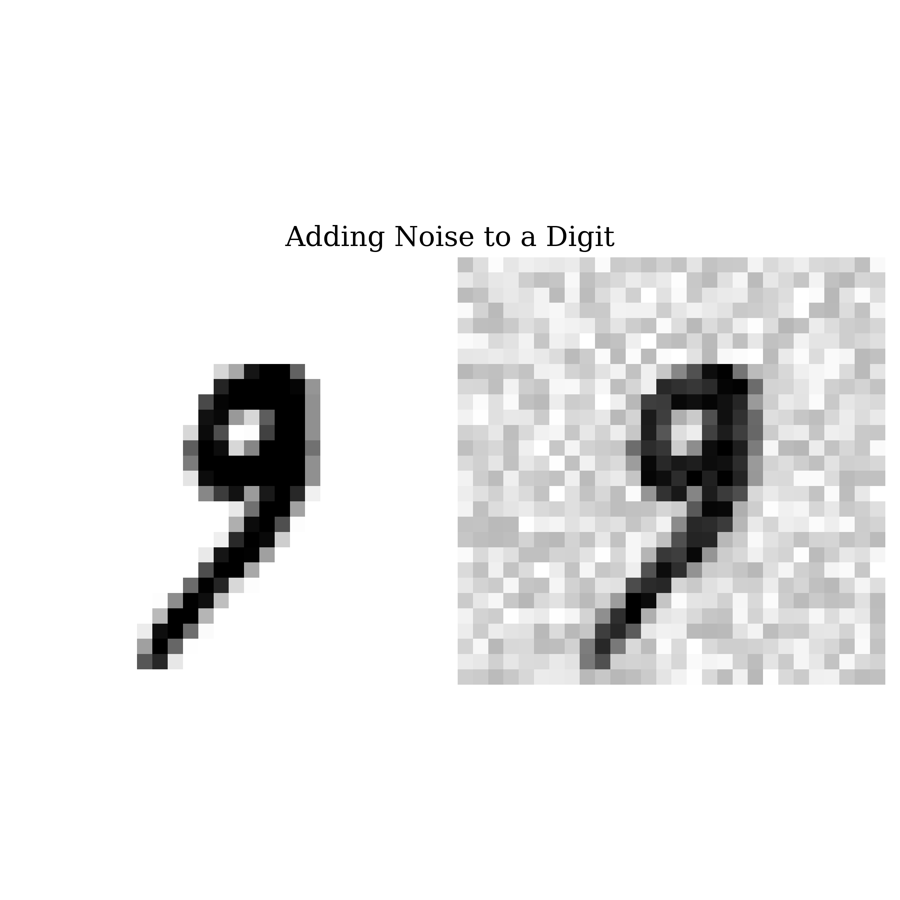
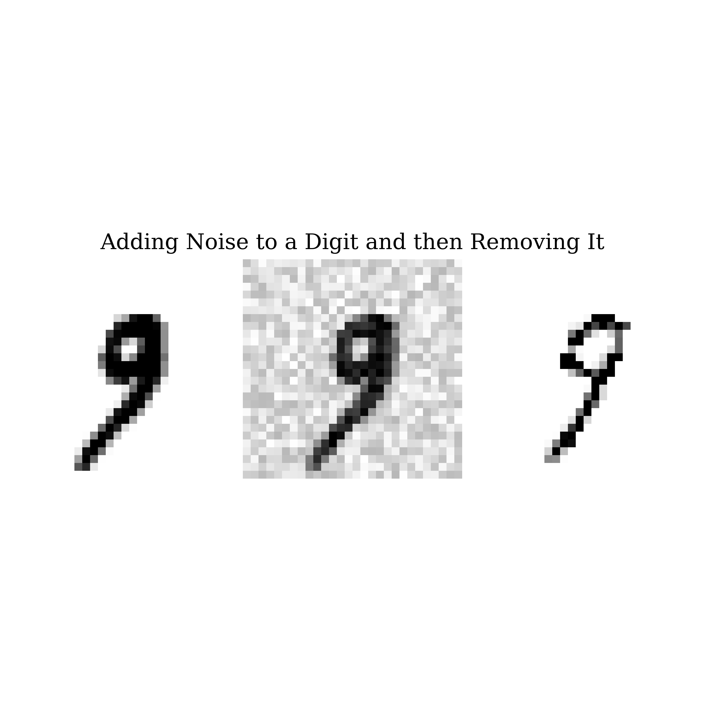

# Machine Learning Classification
## **Look to `classification.ipynb` for a full, general tutorial on machine learning classification.**
### The main modules for this Python notebook are
- `sklearn`
- `pandas`
- `numpy`
- `matplotlib`
- `pathlib`

### You can also look to `requirements.txt` for a list of modules.
____

The models developed in the `classification.ipynb` explore classifying numbers from the [MNIST database](https://en.wikipedia.org/wiki/MNIST_database), a large database of handwritten digits that are commonly used for training various image processing systems.

This database has been used so often it is sometimes called the "hello world" of machine learning classification. Below, you can see some of the interesting figures generated from the notebook. I hope you enjoy the tutorial, and if you have any feedback, please feel free to send me a message!
____

____
## References
1. [Géron, A. (2019, October 15). Classification. Hands-On Machine Learning with Scikit-Learn, Keras, and TensorFlow: Concepts, Tools, and Techniques to Build Intelligent Systems (2nd ed.) (pp. 85-108). O’Reilly Media.](https://www.oreilly.com/library/view/hands-on-machine-learning/9781492032632/)
2. [Aurelion Geron's Personal GitHub Notebook on Classification](https://github.com/ageron/handson-ml2/blob/master/03_classification.ipynb)
3. [The MNIST Database's Wikipedia Page](https://en.wikipedia.org/wiki/MNIST_database)
4. [Professor Yann LeCun's Breakdown of Algorithms Applied to the MNIST Dataset](http://yann.lecun.com/exdb/mnist/)