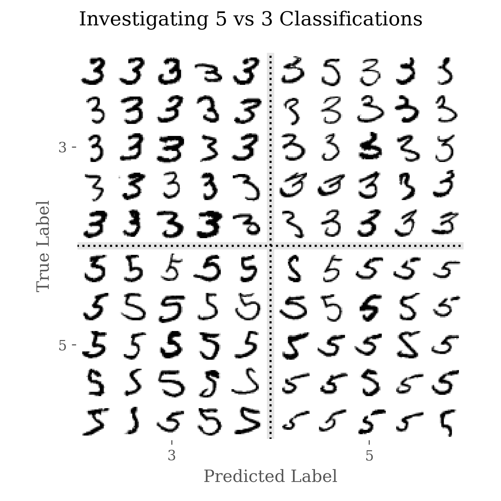
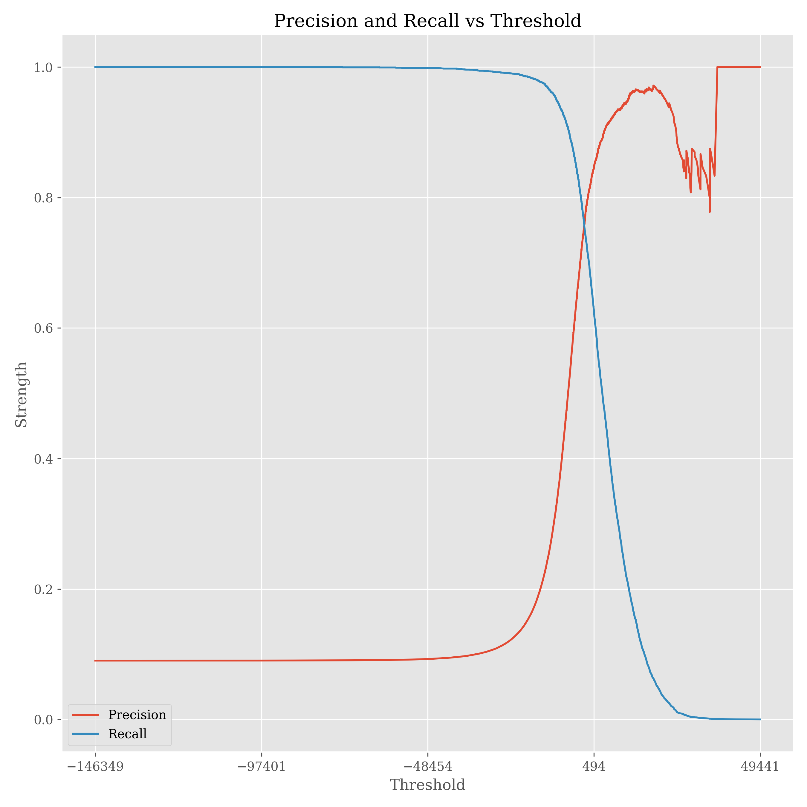
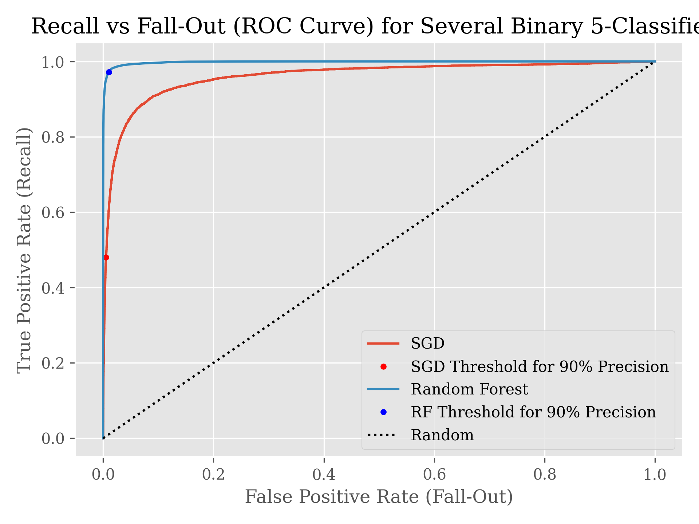

# Machine Learning Classification
## author: Nicholas Cemenenkoff
### Look to `classification.ipynb` for a full, general tutorial on machine learning classification.
#### The main modules for this Python notebook are `sklearn`, `pandas`, `numpy`, `matplotlib`, and `pathlib`. You can also look to `requirements.txt` for a list of modules.

The models developed in the notebook explore classifying numbers from the [MNIST database](https://en.wikipedia.org/wiki/MNIST_database), a large database of handwritten digits that are commonly used for training various image processing systems.

This database has been used so often it is sometimes called the "hello world" of machine learning classification. I hope you enjoy the tutorial, and if you have any feedback, please feel free to send me an email or Teams message!

