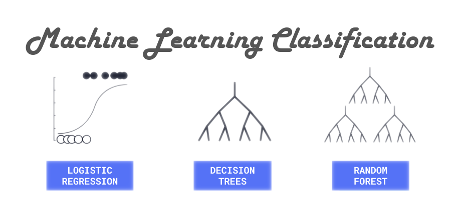
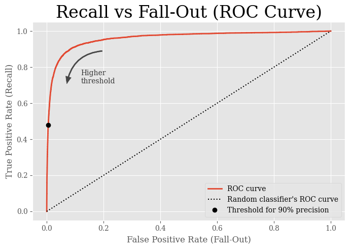

  

Look to [`notebooks/classification.ipynb`](notebooks/classification.ipynb) for a full, general tutorial on machine learning classification.

<!-- TOC start (generated with https://github.com/derlin/bitdowntoc) -->

- [1. Introduction](#1-introduction)
- [2. Figures Created in the Tutorial](#2-figures-created-in-the-tutorial)
- [3. References](#3-references)
- [4. Appendix: Setup for New Developers](#4-appendix-setup-for-new-developers)

<!-- TOC end -->

<!-- TOC -->
## 1. Introduction
The models developed in [`classification.ipynb`](notebooks/classification.ipynb) explore classifying numbers from the [MNIST database](https://en.wikipedia.org/wiki/MNIST_database), a large database of handwritten digits that are commonly used for training various image processing systems. The database has been used so often it is sometimes called the ["hello world"](https://en.wikipedia.org/wiki/%22Hello,_World!%22_program) of machine learning classification.

<!-- TOC -->
## 2. Figures Created in the Tutorial
Data science insights are derived through visualizations. Below, you can see some of the interesting figures you'll be able to generate from the notebook. I hope you enjoy the tutorial. 🌞

  

  

  

  

  

  

  

  

  

  

  

<!-- TOC -->
## 3. References
1. [Géron, A. (2019, October 15). Classification. Hands-On Machine Learning with Scikit-Learn, Keras, and TensorFlow: Concepts, Tools, and Techniques to Build Intelligent Systems (2nd ed.) (pp. 85-108). O’Reilly Media.](https://www.oreilly.com/library/view/hands-on-machine-learning/9781492032632/)
2. [Aurelion Geron's Personal GitHub Notebook on Classification](https://github.com/ageron/handson-ml2/blob/master/03_classification.ipynb)
3. [The MNIST Database's Wikipedia Page](https://en.wikipedia.org/wiki/MNIST_database)
4. [Professor Yann LeCun's Breakdown of Algorithms Applied to the MNIST Dataset](http://yann.lecun.com/exdb/mnist/)

<!-- TOC -->
## 4. Appendix: Setup for New Developers
If you are fairly new to Python programming, I'd recommend the setting up this project by following these steps. If you want more in-depth knowledge about environment setup, I'd recommend you read [my tutorial on interfacing with the computer like a software developer](https://github.com/cemenenkoff/python-essentials-for-stem-wizards).

1. Download and install [VS Code](https://code.visualstudio.com/download).

2. Install [Python 3.12.4](https://www.python.org/downloads/release/python-3124/) (☑️ **Add python.exe to PATH** if you have no other Python versions installed).

3. Install [Git bash](https://git-scm.com/downloads).

4. Open VS Code.

5. Press `F1`, and in the command palette, search for `Terminal: Select Default Profile` and set Git bash as the default terminal.

6. Start a new terminal with `Ctrl` + `` ` ``.

7. Clone this repository to a directory where you like to store your coding projects.

8. Open this repository (i.e. the `ml-classification` folder) as the current workspace folder with `Ctrl` + `K` `Ctrl` + `O`.

9.  Make sure the terminal path points to the `qsnake` folder, and if it doesn't, navigate there via `cd <path_to_ml_classification_folder>`. You can confirm you're in the right spot with quick `ls -la` command.

10. From the terminal, run `pip install virtualenv` to install the `virtualenv` module.

11. Run `python -m virtualenv <myenvname> --python=python3.12.4` to create a virtual environment that runs on Python 3.12.4.

12. Activate the virtual environment with `source <myenvname>/Scripts/activate`.

13. You should see `(<myenvname>)` two lines above the terminal input line when the environment is active.

14. Press `F1` to open VS Code's command palette, then search for `Python: Select Interpreter` and select `Python 3.12.4 64-bit ('<myenvname>':venv)`.

15. Run `pip install -r requirements.txt` to install all dependencies on your activated virtual environment.

16. Navigate to `notebooks/classification.ipynb` and read through the tutorial, running the cells as you go along if you'd like.